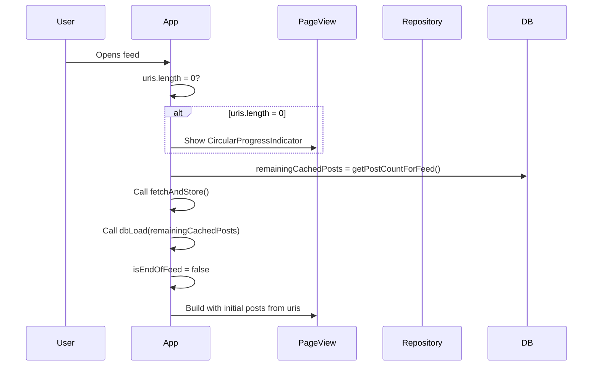
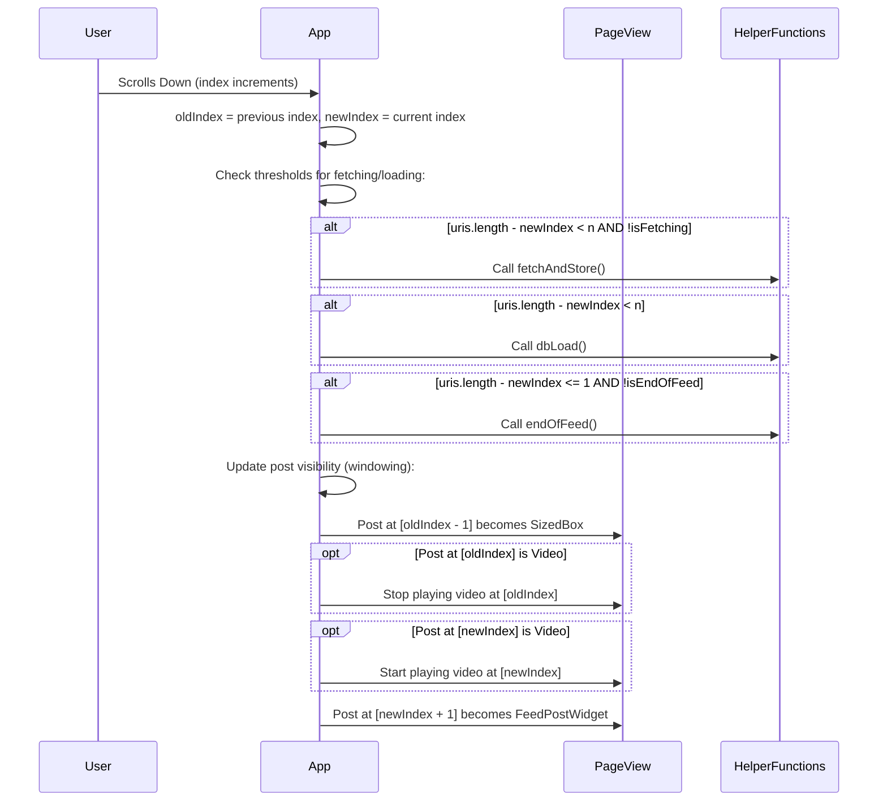
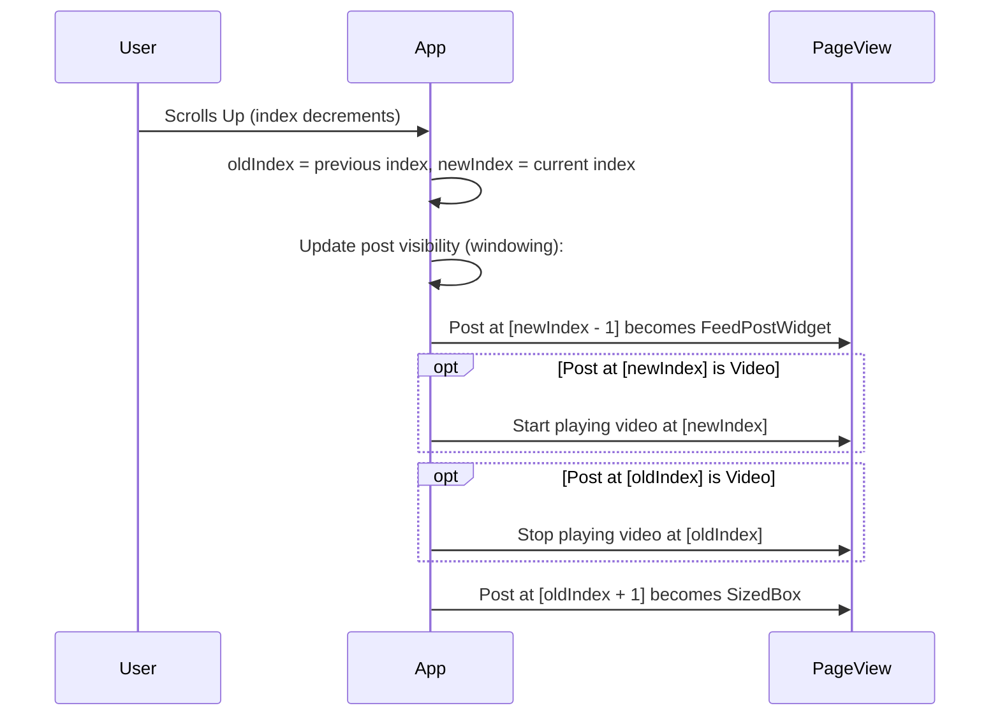
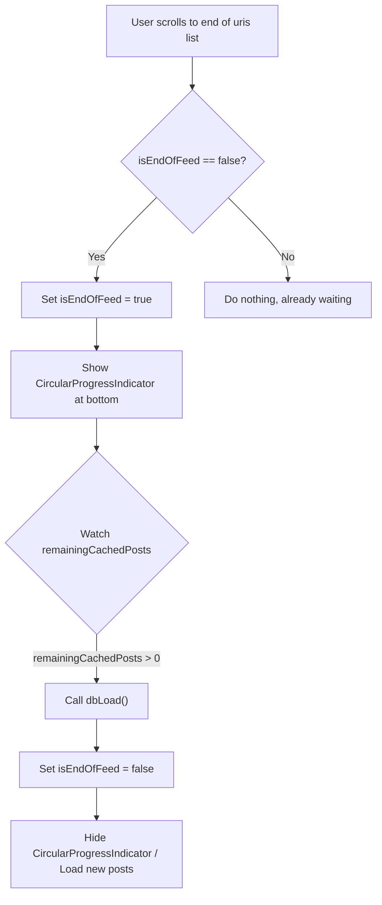
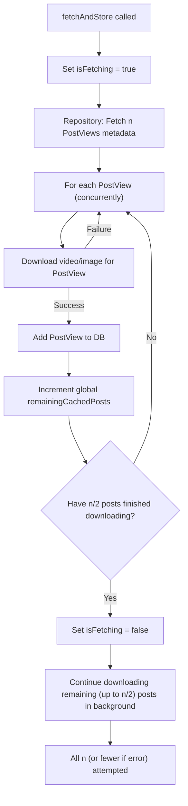

# Spark App: Feed Caching & Rendering Strategy

This document outlines the caching and rendering strategy employed by the Spark app's feed to ensure a smooth, TikTok-like user experience. The primary goals are:

1.  **Performance:** Minimize jank and loading times by pre-fetching and pre-caching content.
2.  **Resource Efficiency:** Only render visible (and nearby) posts, and conserve memory by replacing off-screen posts with `SizedBox` widgets.
3.  **Data Management:** Efficiently load data from the local database and fetch new data from the network.

## Key Components & State Variables

*   **`uris` (List<AtUri>):** The primary list backing the `PageView.builder`. Each item represents a potential post. It can hold a URI to build a `FeedPostWidget` or a special marker to render a `SizedBox`.
*   **`remainingCachedPosts` (int):** The number of posts that have their media (video/image) successfully downloaded and are stored in the local database, ready to be loaded into the `uris` list for display.
*   **`isFetching` (bool):** A flag indicating whether the `fetchAndStore()` process (network fetching and media caching) is currently active.
*   **`isEndOfFeed` (bool):** A flag indicating if the user has scrolled to the end of the currently available posts and the app is waiting for more `remainingCachedPosts` to become available.
*   **`FeedPostWidget`:** The widget responsible for displaying a post's content (video, image, metadata) inside a feed.
*   **`SizedBox`:** A lightweight placeholder widget used for posts that are far off-screen to save rendering resources.
*   **Local Database (DB):** Stores `PostView` objects once their associated media has been successfully downloaded and cached.
*   **Repository:** Handles fetching `PostView` metadata from the network.

## Core Logic Flow

### 1. Initial Feed Load

This is what happens when a user opens a feed for the first time.



*   If `uris` is empty, a `CircularProgressIndicator` is shown.
*   `remainingCachedPosts` is initialized with the count of already cached posts in the DB for this feed.
*   `fetchAndStore()` is called to start fetching new posts from the network and caching their media.
*   `dbLoad()` is called to populate the `uris` list with posts already available in the DB.
*   `isEndOfFeed` is set to `false`.

### 2. Scrolling Down

As the user scrolls down, the app proactively loads more content and manages the visible window of posts.



*   **Proactive Fetching:** If fewer than n posts are ahead of the current view (`uris.length - index < n`) AND we are not already fetching (`!isFetching`), `fetchAndStore()` is called.
*   **Proactive DB Loading:** If fewer than n posts are ahead, `dbLoad()` is called to move posts from DB to `uris`.
*   **End of Feed Detection:** If no posts are ahead (`uris.length - index <= 1`) AND we haven't already marked the end (`!isEndOfFeed`), `endOfFeed()` is called.
*   **View Window Management:**
    *   The post at `oldIndex - 1` (now two screens away) becomes a `SizedBox`.
    *   Video at `oldIndex` (scrolled past) stops playing.
    *   Video at `newIndex` (current view) starts playing.
    *   The post at `newIndex + 1` (next post) is inflated into a `FeedPostWidget`.

### 3. Scrolling Up

Similar to scrolling down, but for navigating backwards.



*   **View Window Management:**
    *   The post at `newIndex - 1` (previous post, now visible) becomes a `FeedPostWidget`.
    *   Video at `newIndex` (current view) starts playing.
    *   Video at `oldIndex` (scrolled past) stops playing.
    *   The post at `oldIndex + 1` (now two screens away) becomes a `SizedBox`.

### 4. Reaching the "End of Feed" (`endOfFeed()`)

This handles the scenario where the user has scrolled through all currently loaded posts in `uris`.



*   `isEndOfFeed` is set to `true`.
*   A `CircularProgressIndicator` is shown at the bottom of the feed.
*   The app watches `remainingCachedPosts`. When it becomes positive (meaning `fetchAndStore()` has successfully cached more items):
    *   `dbLoad()` is called to load these new posts into `uris`.
    *   `isEndOfFeed` is set back to `false`.

### 5. Switching Feeds

When the user navigates to a different feed (e.g., "Following" to "For You").

*   The old feed is marked as inactive.
*   To save resources, all `FeedPostWidget`s in the inactive feed's `uris` list are converted to `SizedBox` widgets.

### 6. Returning to an Inactive Feed

When the user navigates back to a previously viewed (now inactive) feed.

*   The feed is marked as active.
*   The posts immediately around the current scroll position (`index`) are re-inflated:
    *   `FeedPostWidget` at `index - 1` (if it exists).
    *   `FeedPostWidget` at `index`.
    *   `FeedPostWidget` at `index + 1` (if it exists).
*   Video playback logic:
    *   Video at `index - 1` (if any) is stopped (ensuring it's not auto-playing if just revealed).
    *   Video at `index` (if any) starts playing.
    *   Video at `index + 1` (if any) is stopped.

## Helper Functions Deep Dive

### `dbLoad(currentRemainingCachedPosts)`

Loads posts from the local database into the `uris` list for display.

```mermaid
graph TD
    Start[dbLoad called with currentRemainingCachedPosts] --> A{currentRemainingCachedPosts > 0?};
    A -- Yes --> B["amountToLoad = min(currentRemainingCachedPosts, n")];
    B --> C{amountToLoad > 0?};
    C -- Yes --> D[Load 'amountToLoad' most recent PostViews from DB];
    D --> E[Add PostViews to 'uris' list];
    E --> F[remainingCachedPosts -= amountToLoad];
    F --> End[Return];
    A -- No --> End;
    C -- No --> End;
```
*   Determines `amountToLoad`: either `currentRemainingCachedPosts` or `n`, whichever is smaller.
*   If `amountToLoad` is positive:
    *   The `amountToLoad` most recent `PostViews` (which haven't been added to `uris` yet) are fetched from the database.
    *   These are added to the `uris` list.
    *   The global `remainingCachedPosts` is decremented by `amountToLoad`.

### `fetchAndStore()`

Fetches new post metadata from the network, downloads their media, and stores them in the DB.


*   Sets `isFetching` to `true`.
*   The `Repository` fetches metadata for n new `PostViews`.
*   **Concurrently**, for each fetched `PostView`:
    *   Its associated video/image media is downloaded.
    *   Upon successful download of a post's media:
        *   The `PostView` (now with cached media path) is added to the local DB.
        *   The global `remainingCachedPosts` counter is incremented.
*   **Crucially**, after the media for **n/2** posts has finished downloading and they are stored in the DB, `isFetching` is set back to `false`.
    *   This allows `dbLoad()` to potentially be triggered sooner by user scrolling, even if not all n posts from the current batch have finished their media downloads.
    *   The remaining (up to n/2) posts from this batch continue downloading their media and being added to the DB in the background.

## Benefits of this Strategy

*   **Smooth Scrolling:** Proactive fetching and loading keep content ready.
*   **Resource Management:** `SizedBox` placeholders for off-screen content reduce memory and rendering overhead. Only a small window of `FeedPostWidget`s (typically 3) are fully active.
*   **Responsive UI:** `isFetching` becoming `false` after n/2 posts are ready allows the UI to feel responsive and less blocked by network operations.
*   **Offline Availability (Partial):** Posts whose media is downloaded and stored in DB are available even if the network is temporarily lost (for those specific posts).
*   **Efficient Data Usage:** Media is cached, preventing re-downloads.
